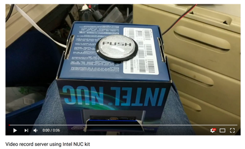

# Camera Recording system using Raspberry Pi & Intel NUC Kit


<a href="https://www.youtube.com/watch?v=6oFUNC1Vjqw"></a>

## 使い方
```
sudo crontab -e
```
以下を追加（OS起動２０秒後にルート権限でデーモンを起動する）
```
@reboot sleep 20 && python /path/to/raspi-nas-camera/IntelNUCKit/record-host.py &
```

